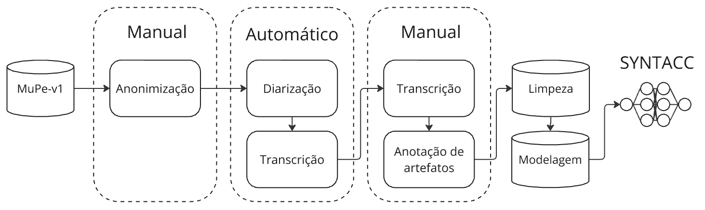
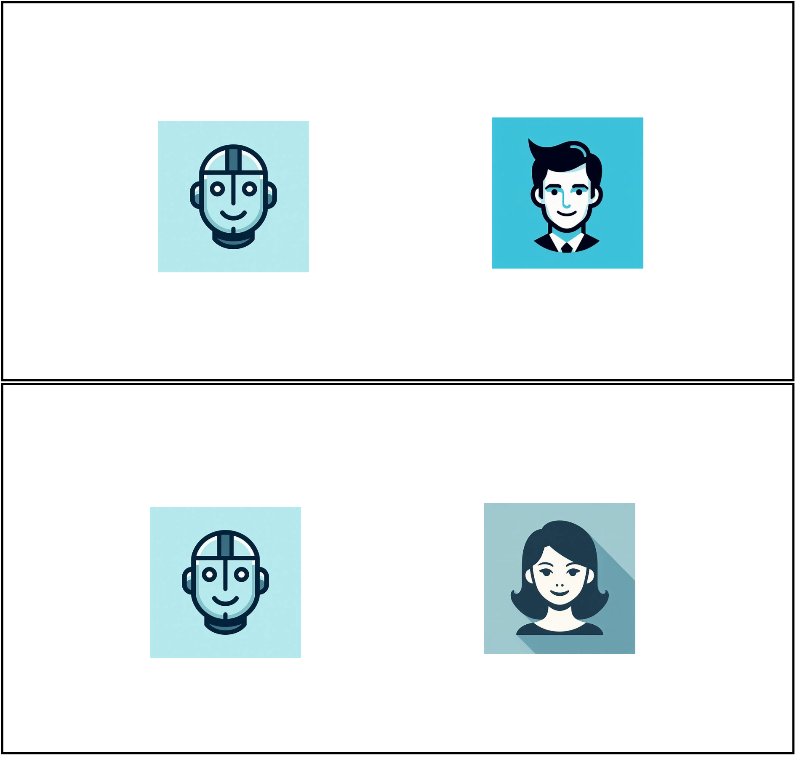

# EyetrackingMOS-STIL

## Revisão sobre métricas subjetivas para análise de sistemas de TTS

\begin{table}[h]
    \centering
        \caption{Mean Opinion Score (MOS) para avaliação de naturalidade}
        \begin{tabular}{lll}
            \hline
            \textbf{Avaliação} & \textbf{Qualidade} & \textbf{Nível de distorção}\\
            \hline
            5 & Excelente & Extremamente natural\\
            4 & Boa & Muito natural\\
            3 & Razoável & Razoavelmente natural\\
            2 & Pobre & Pouco natural\\
            1 & Ruim & Nada natural\\
            \hline
        \end{tabular}
        \label{tab:MOS}
\end{table}

---

## Materiais e métodos
### Pré-processamento

A primeira etapa é a **anonimização**, em que os anotadores ocultaram informações pessoais dos falantes para proteger sua privacidade. Em seguida, realiza-se a **diarização automática**, que segmenta o áudio para identificar e separar diferentes fontes sonoras, como falantes ou ruídos de fundo, utilizando a biblioteca [pyannote](https://github.com/pyannote/pyannote-audio). Esse processo envolve a segmentação inicial do áudio com Detecção de Atividade de Voz (Voice Activity Detection, VAD) e o corte em partes que variam entre 1 e 30 segundos. Depois da **diarização**, ocorre a transcrição automática, onde os segmentos de áudio são convertidos em texto utilizando o Whisper X [Bain, 2022], que transcreve os segmentos de áudio. Esta transcrição é então revisada na etapa de **revisão manual da transcrição automática**, na qual anotadores corrigem possíveis erros, garantindo que o texto seja fiel ao áudio original. Na etapa de **anotação de artefatos**, os anotadores marcam no texto os trechos que contêm ruídos, cortes abruptos, palavras inaudíveis, mudanças de tom, ou outros elementos que possam interferir na qualidade da síntese de fala. Essas anotações são essenciais para identificar e tratar variações no áudio que possam afetar o treinamento do modelo. Na etapa de **limpeza dos dados**, são corrigidos erros e removidos segmentos problemáticos. Segmentos com falantes sem identificação ou transcrições inadequadas são removidos, e dados como nomes de cidades são padronizados. Por fim, na etapa de **modelagem dos dados**, os dados são organizados no formato adequado para uso em modelos de síntese de fala.

---

### Modelo de Síntese

#### SYNTACC

O **SYNTACC** inclui componentes como o variational autoencoder (VAE) e outros elementos que visam melhorar a síntese de fala. O preditor de duração estocástico e o alinhamento monotônico auxiliam na diversidade e fluidez das sínteses de áudio.

Tabela de configuração de treinamento:
| Aspectos | Valores |
| --- | --- |
| SAMPLE_RATE | 16kHz |
| MAX_AUDIO_LEN_IN_SECONDS | sem limites |
| RESTORE_PATH | checkpoint |
| BATCH_SIZE | 26 |
| DASHBOARD_LOGGER | tensorboard |
| optmizer | AdamW |
| lr | 0.001 |
| lr_gen | 0.0002 |
| lr_scheduler_gen | ExponentialLR |
| lr_disc | 0.0002 |
| lr_scheduler_disc | ExponentialLR |

---

### Experimentos

O modelo foi avaliado utilizando o MOS e o EyetrackingMOS para medir a qualidade e percepção dos estímulos sonoros. A figura abaixo demonstra o fluxo da avaliação:

####Interface

A imagem abaixo corresponde a interface que o usuário recebe durante os estímulos de áudio masculinos e femininos, respectivamente, como demonstrado no artigo.

####Estímulos

Os arquivos de áudio presentes na pasta `stimuli` são utilizados durante os testes.

---

## Referências

- Bain, M. et al. WhisperX: Multilingual Speech Recognition and Alignment, 2022.
