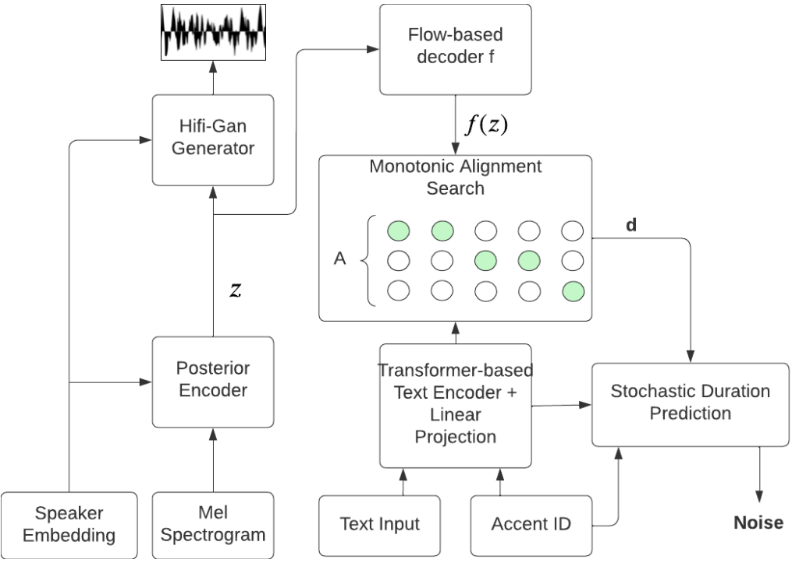

# EyetrackingMOS-STIL

## Revisão sobre métricas subjetivas para análise de sistemas de TTS

Um padrão de referência de análise para descrever pontuação MOS para os avaliadores é apresentado na tabela abaixo [Loizou, 2011]:

| **Rating** | **Speech quality** (Qualidade da fala) | **Level of distortion** (Nível de distorção)           |
|------------|----------------------------------------|-------------------------------------------------------|
| 5          | Excellent (Excelente)                  | Imperceptible (Imperceptível)                         |
| 4          | Good (Boa)                             | Just perceptible, but not annoying (Apenas perceptível, mas não incômoda) |
| 3          | Fair (Razoável)                        | Perceptible and slightly annoying (Perceptível e ligeiramente incômoda) |
| 2          | Poor (Ruim)                            | Annoying, but not objectionable (Incômoda, mas aceitável) |
| 1          | Bad (Péssima)                          | Very annoying and objectionable (Muito incômoda e inaceitável) |
---

## Materiais e métodos
### Pré-processamento

A primeira etapa é a **anonimização**, em que os anotadores ocultaram informações pessoais dos falantes para proteger sua privacidade. Em seguida, realiza-se a **diarização automática**, que segmenta o áudio para identificar e separar diferentes fontes sonoras, como falantes ou ruídos de fundo, utilizando a biblioteca [pyannote](https://github.com/pyannote/pyannote-audio). Esse processo envolve a segmentação inicial do áudio com Detecção de Atividade de Voz (Voice Activity Detection, VAD) e o corte em partes que variam entre 1 e 30 segundos. Depois da **diarização**, ocorre a transcrição automática, onde os segmentos de áudio são convertidos em texto utilizando o Whisper X [Bain, 2022], que transcreve os segmentos de áudio. Esta transcrição é então revisada na etapa de **revisão manual da transcrição automática**, na qual anotadores corrigem possíveis erros, garantindo que o texto seja fiel ao áudio original. Na etapa de **anotação de artefatos**, os anotadores marcam no texto os trechos que contêm ruídos, cortes abruptos, palavras inaudíveis, mudanças de tom, ou outros elementos que possam interferir na qualidade da síntese de fala. Essas anotações são essenciais para identificar e tratar variações no áudio que possam afetar o treinamento do modelo. Na etapa de **limpeza dos dados**, são corrigidos erros e removidos segmentos problemáticos. Segmentos com falantes sem identificação ou transcrições inadequadas são removidos, e dados como nomes de cidades são padronizados. Por fim, na etapa de **modelagem dos dados**, os dados são organizados no formato adequado para uso em modelos de síntese de fala.

---

### Modelo de Síntese

O **SYNTACC** [Nguyen, 2023] inclui componentes como o variational autoencoder (VAE) e outros elementos que visam melhorar a síntese de fala. O preditor de duração estocástico e o alinhamento monotônico auxiliam na diversidade e fluidez das sínteses de áudio.  Destaca-se também a presença de componentes intermediários. Durante o treinamento, os áudios foram reamostrados para 16 kHz, e o modelo SYNTACC, foi pré-treinado utilizando um _checkpoint_ disponível na plataforma Coqui. O tamanho do _batch_ foi definido como 26, equilibrando a eficiência do treinamento e a capacidade de memória. O treinamento foi monitorado com o _TensorBoard_, permitindo a visualização das métricas em tempo real. Os dados de entrada foram organizados em 13 _datasets_ diferentes, correspondentes aos diferentes sotaques linguísticos regionais e internacionais. O treinamento utilizou o otimizador AdamW, com uma taxa de aprendizado inicial de 0,001 ajustada exponencialmente ao longo das épocas para melhorar a convergência (ver tabela abaixo para detalhes). Os parâmetros de configuração, como a escala do ruído para inferência (**inference_noise_scale**) e o _Stochastic Duration Predictor_, foram ajustados para 0,33. Durante o processo de avaliação, foram utilizadas sentenças de teste variadas para cobrir diferentes padrões de fala, refletindo a diversidade linguística abordada pelo modelo. Isso incentiva o modelo a generalizar, sintetizando fala de novos falantes e sotaques não observados durante o treinamento. Ao total, o modelo sintetizou as falas do experimento com um treinamento de 295 mil _steps_ no MuPe-v1. Na Figura abaixo, é apresentado o diagrama de treino. O _variational autoencoder_ (VAE), aqui identificado como codificador posterior (_posterior encoder_), é utilizado com o objetivo de melhorar o aprendizado fim-a-fim ao mapear melhor variações e incertezas, recebendo um espectrograma linear e os embeddings dos falantes e prediz uma variável latente $z$. Esta é utilizada tanto para o treinamento do _vocoder_ quanto para o decodificador baseado em fluxo (_flow-based decoder_), que tem como objetivo condicionar a variável latente $z$ e os _embeddings_ de locutores em relação a uma distribuição probabilística. O componente de busca de alinhamento monotônico (_Monotonic Alignment Search_ - MAS) tem como objetivo alinhar a saída do decodificador baseado em fluxo com a saída do codificador de texto. O preditor de duração estocástico (_stochastic duration preditor_), tem como ideia central permitir uma diversificação maior de ritmo na síntese a partir de texto ao receber a duração do MAS, os _embeddings_ dos locutores e dos idiomas.

Tabela de configuração de treinamento:
| Aspectos | Valores |
| --- | --- |
| SAMPLE_RATE | 16kHz |
| MAX_AUDIO_LEN_IN_SECONDS | sem limites |
| RESTORE_PATH | checkpoint |
| BATCH_SIZE | 26 |
| DASHBOARD_LOGGER | tensorboard |
| optmizer | AdamW |
| lr | 0.001 |
| lr_gen | 0.0002 |
| lr_scheduler_gen | ExponentialLR |
| lr_disc | 0.0002 |
| lr_scheduler_disc | ExponentialLR |

---

### Experimentos

O modelo foi avaliado utilizando o MOS e o EyetrackingMOS para medir a qualidade e percepção dos estímulos sonoros. A imagem abaixo corresponde a interface que o usuário recebe durante os estímulos de áudio masculinos e femininos, respectivamente, como demonstrado no artigo. Os arquivos de áudio presentes na pasta `stimuli` são utilizados durante os testes.

---

## Referências

- Bain, M. et al. WhisperX: Multilingual Speech Recognition and Alignment, 2022.

- Loizou, P. C. Speech Quality Assessment, pages 623–654, 2011. Springer Berlin Heidelberg, Berlin, Heidelberg.

- Nguyen, T.-N., Pham, N.-Q., and Waibel, A. Syntacc: Synthesizing multi-accent speech by weight factorization, 2023. In ICASSP 2023-2023 IEEE International Conference on Acoustics, Speech and Signal Processing (ICASSP), pages 1–5. IEEE.
